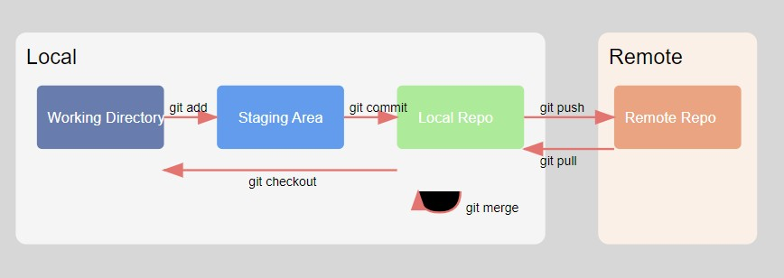

# Git Training Guide

## Table of Contents
- [Introduction](#introduction)
- [Installation and Setup](#installation-and-setup)
- [Basic Commands](#basic-commands)
- [File Operations](#file-operations)
- [Stashing Changes](#stashing-changes)
- [Reset and HEAD](#reset-and-head)
- [Remote Operations](#remote-operations)
- [Branching and Merging](#branching-and-merging)
- [Best Practices](#best-practices)
- [Troubleshooting](#troubleshooting)
- [Additional Resources](#Additional Resources)

## Introduction

Git is a distributed version control system that helps track changes in source code during software development.

### Git Workflow

Git manages your code across different areas, as shown in this workflow diagram:




Understanding these areas is crucial:
- **Working Directory**: Where you edit and create files
- **Staging Area**: A temporary area where you prepare changes for committing
- **Local Repository**: Your local copy of the Git repository with all version history
- **Remote Repository**: The server-hosted version of your repository (like on GitHub)

Key commands that move code between these areas:
- `git add`: Working Directory → Staging Area
- `git commit`: Staging Area → Local Repository
- `git push`: Local Repository → Remote Repository
- `git pull`: Remote Repository → Local Repository
- `git checkout`: Local Repository → Working Directory


### Additional Key Concepts

- **Repository (Repo)**: A directory containing your project's files and Git's version control information
- **Commit**: A snapshot of your files at a specific point in time
- **Branch**: An independent line of development
- **Remote**: A repository hosted on the internet or network
- **HEAD**: A pointer that references the current branch/commit in your repository

## Installation and Setup

### Installing Git

- **Windows**: Download from https://git-scm.com/download/win
- **macOS**: Install using Homebrew: `brew install git`
- **Linux**: `sudo apt-get install git` (Ubuntu/Debian) or `sudo dnf install git` (Fedora)

### Initial Configuration

```bash
git config --global user.name "Your Name"
git config --global user.email "your.email@example.com"
# View configuration
cat ~/.gitconfig
# Verify installation
git --version
```

## Basic Commands

### Creating a Repository

```bash
# Initialize a new repository
git init

# Clone an existing repository
git clone <repository-url>
```

### Basic Workflow

```bash
# Check status of your files
git status

# Add files to staging area
git add <filename>
git add .  # Add all files

# Commit changes
git commit -m "Your commit message"

# Amend commit message
git commit --amend -m "New message"

# View commit history
git log
git log --oneline  # Compact view
git show <commit-id>  # View specific commit details
```

## File Operations

### Tracking Files

```bash
# View tracked files
git ls-files

# Remove files
git rm <file>  # Remove from working directory and staging
git rm --cached <file>  # Remove from repo but keep in working directory
git rm -f <file>  # Force remove

# Ignore files
vim .gitignore  # Create/edit .gitignore file

# Rename files
git mv <old-name> <new-name>
```

### Comparing Changes

```bash
# View unstaged changes
git diff <file>

# View staged changes
git diff --staged <file>

# Discard changes
git restore <file>  # Discard working directory changes
git restore --staged <file>  # Unstage changes
```

## Stashing Changes

### Basic Stash Operations

```bash
# Stash current changes
git stash

# List stashes
git stash list

# View stash contents
git show stash@{0}

# Apply stash (keep in stash list)
git stash apply stash@{0}

# Apply and remove stash
git stash pop stash@{0}

# Remove stash
git stash drop stash@{0}

# Partial stash (interactive)
git stash -p  # Choose which changes to stash
```

## Reset and HEAD

### Understanding HEAD
HEAD is a pointer that references the latest commit in your current branch. It moves automatically when you make new commits or switch branches.
HEAD is a dangerous operation, especially git reset --hard. It's a good practice to avoid using it unless absolutely necessary.

### Reset Types

```bash
# Soft reset - preserve staging and working directory
git reset --soft HEAD~1

# Mixed reset (default) - preserve working directory only
git reset HEAD~1
git reset --mixed HEAD~1

# Hard reset - discard all changes
git reset --hard HEAD~1

# Reset to specific commit
git reset --hard <commit-id>
```

## Remote Operations

### Pull Request Workflow
```bash
# Create feature branch
git checkout -b feature-name

# Make changes and commit
git add .
git commit -m "Implement feature"

# Push to remote
git push origin feature-name

# Create Pull Request on GitHub/GitLab/BitBucket
# 1. Go to repository website
# 2. Click "New Pull Request"
# 3. Select base branch (main) and compare branch (feature-name)
# 4. Fill PR description and request reviews
# 5. Submit PR and address review comments

# After PR is approved and merged
git checkout main
git pull origin main
git branch -d feature-name
```


### Fork-Based Workflow 

```
# Fork via platform UI (GitHub/GitLab)

# Clone your fork
git clone https://github.com/username/repo.git

# Add upstream remote
git remote add upstream https://github.com/original/repo.git

# Keep fork in sync
git fetch upstream
git checkout main
git merge upstream/main

# Create feature branch and contribute
git checkout -b feature
# Make changes, commit, push to fork
git push origin feature

# Create PR from fork to upstream

Best practices:
- Regularly sync fork with upstream
- Base feature branches on latest upstream main
- One feature/bugfix per PR
- Follow upstream's contribution guidelines
```

### Managing Remotes

```bash
# Add remote repository
git remote add origin <repository-url>
git remote add <name> <repository-url>  # Add additional remote

# View remotes
git remote -v

# Change remote URL
git remote set-url origin <new-url>

# Push changes
git push <remote> <branch>
git push origin master

# Fetch changes
git fetch origin  # Download changes without merging

# Pull changes (fetch + merge)
git pull origin master

# View remote branches
git branch -a

# Compare local and remote
git diff master remotes/origin/master
```

## Branching and Merging

### Branch Management

```bash
# Create new branch from master branch
git branch <branch-name> master

# create a branch from the current branch
git branch <branch-name>

# Switch branch
git checkout <branch-name>

# Create  and switch
git checkout -b <branch-name>

# Delete branch
git branch -d <branch-name>  # Safe delete
git branch -D <branch-name>  # Force delete

# Delete remote branch
git push origin --delete <branch-name>
```

### Handling Merge Conflicts

When a merge conflict occurs:

1. Open the conflicted file
2. Look for conflict markers:
   ```
   <<<<<<< HEAD
   Your changes
   =======
   Their changes
   >>>>>>> branch-name
   ```
3. Edit the file to resolve conflicts
4. Add and commit the resolved file:
   ```bash
   git add <resolved-file>
   git commit -m "Resolved merge conflict"
   ```
To Abort the merge process
```git merge --abort```


## Best Practices

1. **Commit Messages**
   - Write clear, concise commit messages
   - Use present tense
   - Include context

2. **Branching Strategy**
   - Use feature branches
   - Keep main/master branch stable
   - Delete merged branches(feature)

3. **Commit Frequency**
   - Commit logical units of work
   - Avoid mixing unrelated changes
   - Use meaningful commit messages

4. **Remote Operations**
   - Pull before pushing
   - Use fetch to review changes
   - Handle conflicts promptly

## Troubleshooting

### Common Issues

1. **Merge Conflicts**
   - Pull latest changes before merging
   - Communicate with team members
   - Use `git status` to identify conflicted files

2. **Lost Changes**
   - Use `git reflog` to find lost commits
   - Restore from stash if available
   - Check other branches

3. **Remote Issues**
   - Verify remote URLs
   - Check network connection
   - Ensure proper permissions

## Additional Resources

- [Official Git Documentation](https://git-scm.com/doc)
- [Git Cheat Sheet](https://education.github.com/git-cheat-sheet-education.pdf)
- [Pro Git Book](https://git-scm.com/book/en/v2)
